# Fluxograma de Validação de ECG

Este fluxograma representa o ciclo de validação diária dos exames de ECG, com login, fila de trabalho, tela de validação e revalidação geral no dia 30.

```mermaid
flowchart TD
    A([Início do ciclo de validação])

    A --> B[DIA 1<br/>Tela de login<br/>Login e senha<br/>Exibe dia da semana + tipo de ECG do dia]
    B --> C[Home<br/>Fila de trabalho e exames disponíveis]
    C --> D[Tela de validação do ECG<br/>Revisar diagnóstico, ECG e dados clínicos]
    D --> E{Há outro exame<br/>para validar no dia?}
    E -- Sim --> C
    E -- Não --> F[Encerrar validações do Dia 1]

    F --> G[DIA 2<br/>Tela de login<br/>Login e senha<br/>Exibe dia da semana + tipo de ECG do dia]
    G --> H[Home<br/>Fila de trabalho e exames disponíveis]
    H --> I[Tela de validação do ECG<br/>Revisar diagnóstico, ECG e dados clínicos]
    I --> J{Há outro exame<br/>para validar no dia?}
    J -- Sim --> H
    J -- Não --> K[Encerrar validações do Dia 2]

    K --> L[Repetir fluxo diário<br/>Dias 3 até 29<br/>Login → Home → Validação ECG → Home]
    L --> M{Chegou ao Dia 30?}

    M -- Não --> L
    M -- Sim --> N[DIA 30<br/>Tela de login<br/>Login e senha<br/>Exibe dia da semana + tipo de ECG/revalidação geral]

    N --> O[Home<br/>Lista geral de exames feitos nos dias anteriores]
    O --> P[Tela de validação geral<br/>Revisão mais cuidadosa de todos os exames]
    P --> Q[Verificar possíveis adições de diagnósticos]
    Q --> R[Revalidar exames e confirmar resultados finais]
    R --> S{Todos os exames<br/>foram revisados?}
    S -- Não --> O
    S -- Sim --> T([Fim do ciclo de 30 dias])
```

## Leitura do fluxo

Nos dias 1 a 29, o médico acessa o sistema, vê o tipo de ECG previsto para o dia, entra na home, valida os exames da fila e retorna para a home até concluir os exames disponíveis.

No dia 30, o fluxo muda para uma revalidação geral: todos os exames feitos anteriormente são revisados com mais cuidado, considerando possíveis diagnósticos adicionados e a confirmação final dos resultados.
